## Profiling `cmsRun` on a remote macnine with the NVIDIA Visual Profiler

Below are the instructions to profile a `cmsRun` job - running on a remote machine - with the NVIDIA Visual Profiler on the local desktop.
For more information on profiling CUDA applications, and on the NVIDIA Visual Profiler, please check the [Profiler User's Guide](https://docs.nvidia.com/cuda/profiler-users-guide/index.html).

The latest version of the `nvprof-remote` script was introduced in the Patatrack pull request [#264](https://github.com/cms-patatrack/cmssw/pull/264).
It can be merged on top of `CMSSW_10_5_0_pre1_Patatrack` with
```bash
cmsrel CMSSW_10_5_0_pre1_Patatrack
cd CMSSW_10_5_0_pre1_Patatrack/src
git cms-init -x cms-patatrack
git checkout cms-patatrack/CMSSW_10_5_0_pre1_Patatrack -b development_branch
git cms-merge-topic cms-patatrack:264
git cms-checkdeps -a
scram b -j
```

Later releases should alredy integrate the updated tool.

### Create a new Visual Profiler session

Create a new Visual Profiler session from the **File**, **New Session** menu:

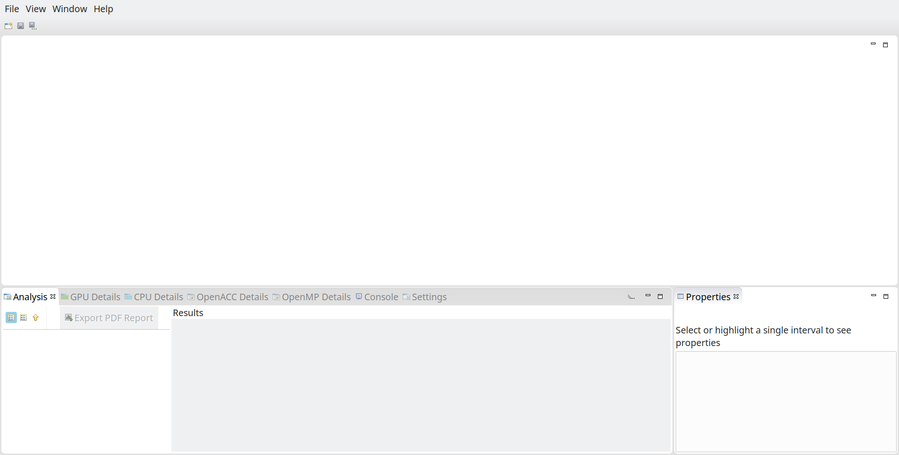

### Manage remote connections

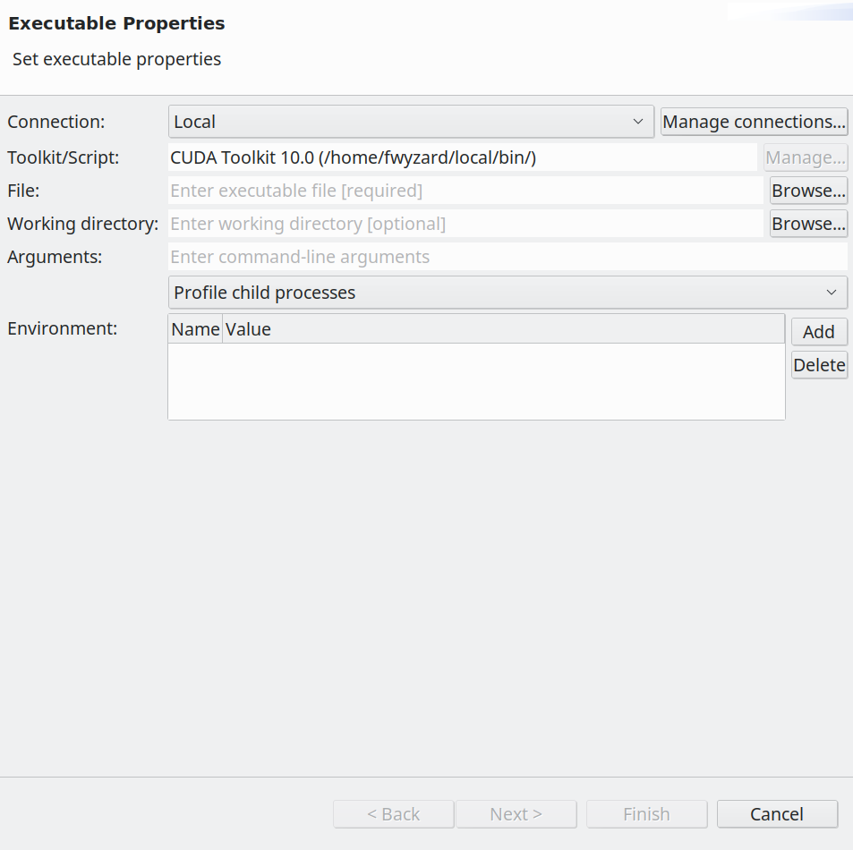

On the **Connection** row, click on `Manage connections...`:

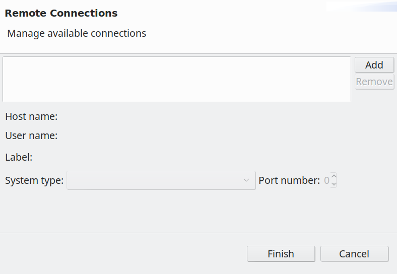

`Add` a new connection, and fill the **Host name**, **User name** and other fields as needed.
The **Label** is filled by default, but any name can be used. 

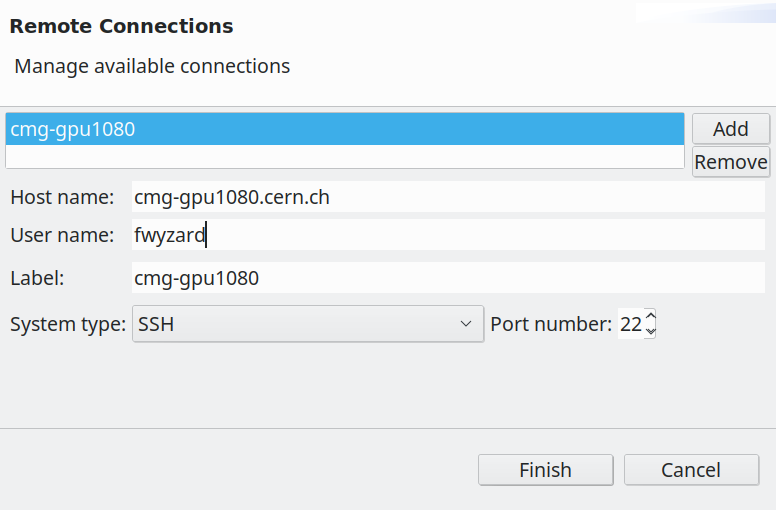

Click on `Finish` to return to the previous window.

### Manage Remote Toolkits

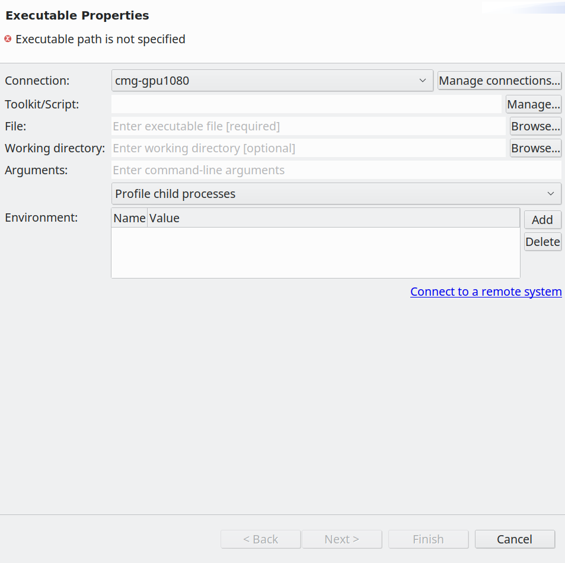

On the **Toolkit/Script** row, click on `Manage...` to open the **Configure CUDA Toolkit** window:

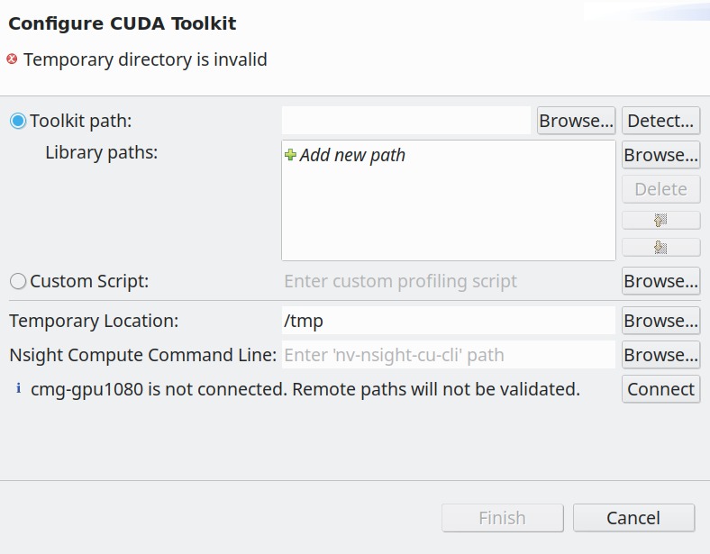

`Connect` to the remote host, then select **Custom Script** and `Browse...` for the `nvprof-remote` script.
An easy way to figure out what to use run on the remote machine
```bash
readlink -f `which nvprof-remote`
```
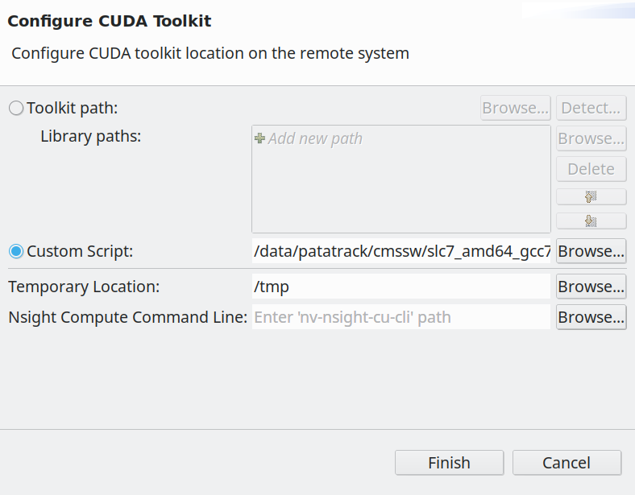

Click on `Finish` to return to the previous window.

### Set up the `cmsRun` job

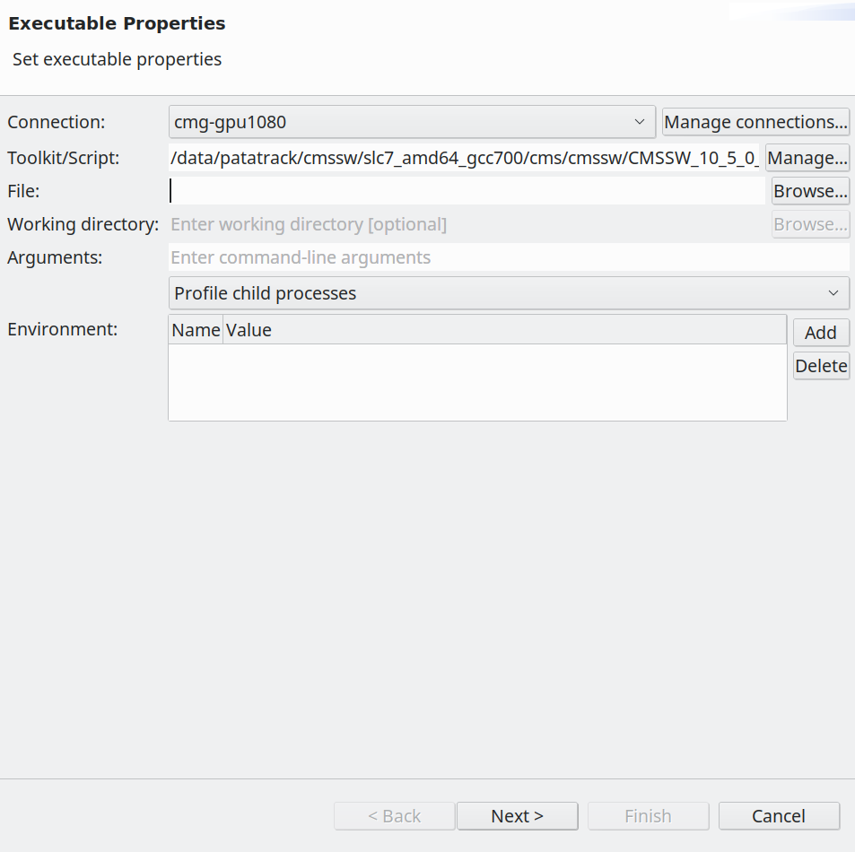

Fill the **File** with "cmsRun".  
Fill the **Arguments** with the full path to the python configuration, and any other arguments passed to `cmsRun`.

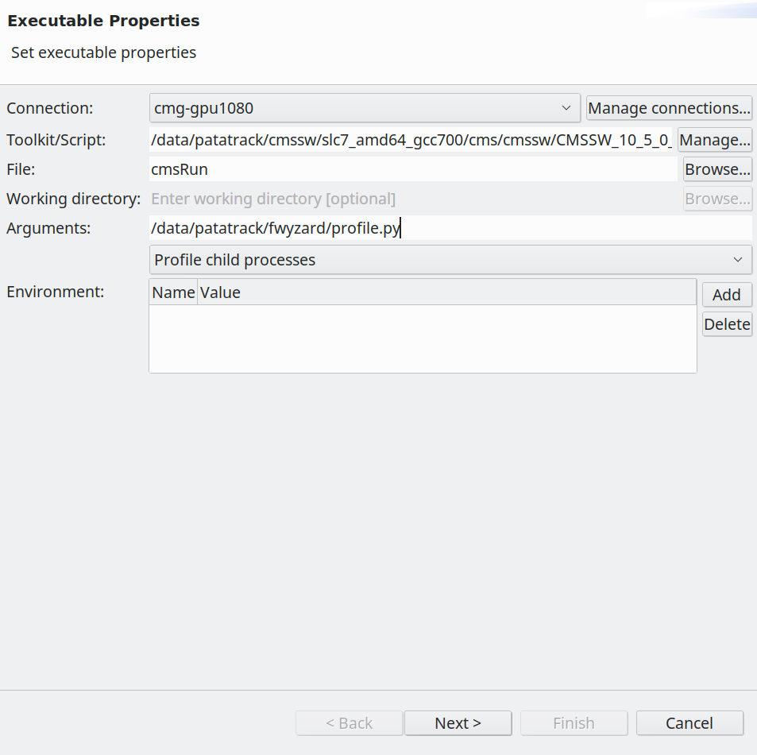

To run using your working area, set the `CMSSW_BASE` environment variable - otherwise the job will run using only the unmodified release.  
in the **Environment** section, `Add` a new variable:

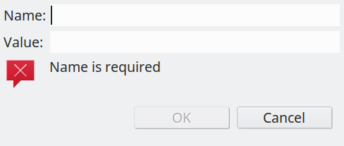

Set the **Name** to `CMSSW_BASE`.
Set the **Value** to the full path ot your working area, for example as reported by
```bash
readlink -f $CMSSW_BASE
```

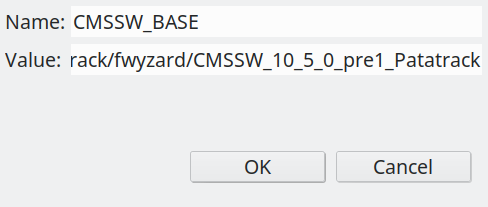

Click `OK` to return to the previous window.

### Profiling Options


Change the `Profile child processes` drop down menu to `Profile current process only`:

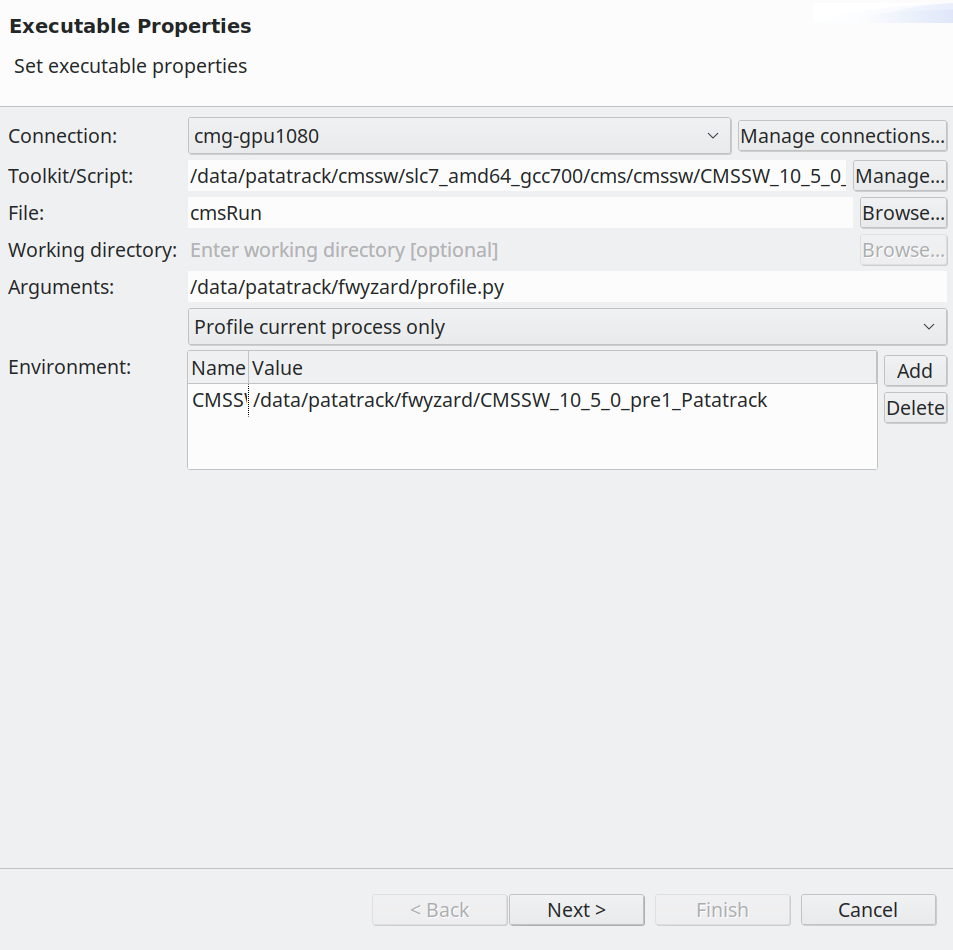

Then click `Next >` to move to the **Profiling Options** window:

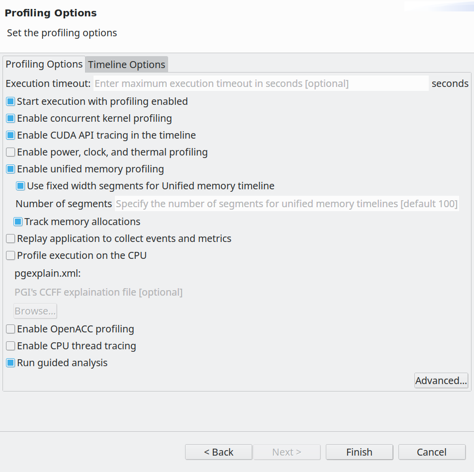

Once you are satified with the options (the default is a reasonable starting point), click `Finish` to start profiling the remote job.

