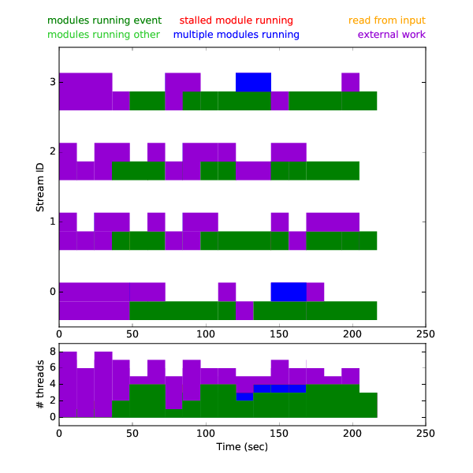

## Benchmarking with StallMonitor service

The CMSSW framework includes a `StallMonitor` service to produce a log
file of stalls (no work to do) within edm streams, and
`edmStreamStallGrapher.py` script to produce nice plots from the log
file. Please see `edmStreamStallGrapher.py -h` for more information.

### Example

Add the following to your configuration file
```
process.add_(cms.Service("StallMonitor", fileName = cms.untracked.string("stallMonitor.log")))
```

Run your configuration normally, and you should get a `stallMonitor.log` file. Running
```
edmStreamStallGrapher.py stallMonitor.log
```
will print the stall graph as ASCII art. The graph can also be exported as a PDF with
```
edmStreamStallGrapher.py stallMonitor.log -g [stall.pdf]
```
where `stall.pdf` is the default output file name. With `-s` parameter
also a "stacked" graph is included in the file (=sum of per-stream graphs).

### Interpreting the result

Here is an example from a job with the following properties
* 10 events, 4 edm::Streams, 4 threads, 3 GPUs
  * edm::Streams 1 and 4 are assigned to GPU 0
  * edm::Stream 2 is assigned to GPU 1
  * edm::Stream 3 is assigned to GPU 2
* Modules
  - 4 stream-type producers with GPU work (via `ExternalWork`), such that
    * Producer 1 takes no input
    * Producer 2 depends on 1
    * Producer 3 depends on 1
    * Producer 4 takes no input
    * So producers 2 and 3 can run concurrently, and 4 can run concurrenclty wrt. 1-3
  - 1 global-type analyzer reading the output of producers 2, 3, and 4



The x axis shows the time in seconds. In the top graph, there is a
sub-graph per edm stream showing the activities of that stream. The
color coding is

* empty: No module was running on the stream, and no `ExternalWork` could have been running either
* orange: At least one module was running, and at least one of the modules running was the source. Often these are so small that they cannot be seen or have zero width.
* red: At least one module was running, none of the running modules was the source, and at least one of the modules running was a module that at least one point in the job stalled.
  - This does **not** indicate that there was a module stalled at that point in time. Instead it means a module was running that at some **other** time was stalled.
* green: At least one module was running, none of the running modules was ever stalled, and none of the running modules is the source.
* blue: Like green but there are multiple modules running.
* purple: Not any other color and `ExternalWork`is running between the end of its `acquire()` and the beginning of its `produce()`
  - This does not necessarily mean that the external work is actually running, only that it may be running (as framework does not know what exactly e.g. a GPU is doing)

The number of "rows" per stream shows the number running modules in the Stream.

The stacked plot at the bottom is simply the sum of the others.


Let's then try to interpret the plot above
* There are no stalls
  - This is expected as global and stream modules cannot stall (by construction)
* Stream 0
  - The job starts by running two external workers in parallel
  - Around 50 s one external worker stops, and a regular module starts to run
  - Around 120 s there is only one external module running
  - Around 150-170 s there are two regular modules running
* Globally
  - In the beginning there are only external workers running
  - Around 80 s there is only one CPU thread running
  - Around 130 s and 150 s one stream (3 and 0) runs multiple modules,
    i.e. both in two threads. This is possible because other stream(s)
    are running external work, so there are CPU threads free
* Stack plot
  - The sum of green and blue is at most the number of threads
  - With external workers we gain more (possible) parallelism
