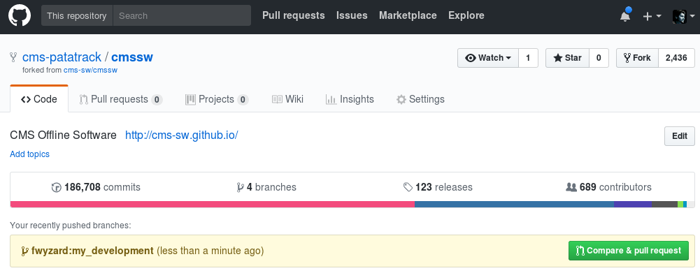
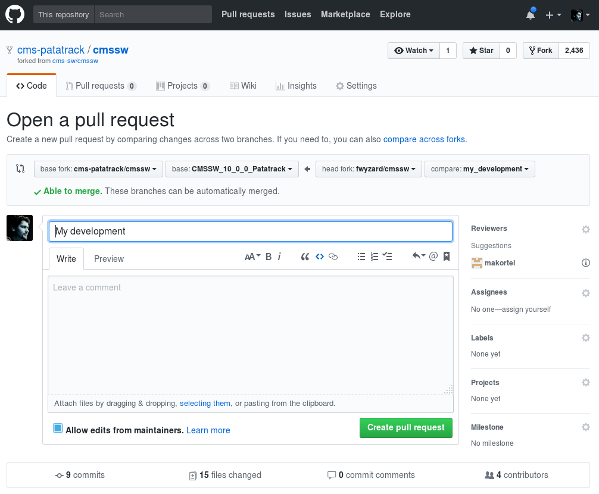

## Simple recipe for developing with Patatrack
The current Patatrack development branch is based on `CMSSW_10_1_0_pre2`, and uses the `slc7_amd64_gcc630` architecture.  
For a different branch and architatcure, adapt these instructions as needed.

### Create a local working area as usual
```bash
export SCRAM_ARCH=slc7_amd64_gcc630
cmsrel CMSSW_10_1_0_pre2
cd CMSSW_10_1_0_pre2/src/
cmsenv
git cms-init
```

### Update externals
Update the versions of Eigen and CUDA to the latest ones
```bash
ls /eos/user/f/fwyzard/www/patatrack/tools/eigen.xml /eos/user/f/fwyzard/www/patatrack/tools/cuda*.xml | xargs -n1 scram setup
scram b
```

### Setup the NVIDIA drivers
CMSSW is set up to pick up the NVIDIA drivers and CUDA runtime from the host machine.
If the machine you are using has one or more NVIDIA GPUs with CUDA 9.1 already installed, you don't need to do anything to use them.

If the machine you are using *does not have* a GPU with the NVIDIA drivers and CUDA runtime, set them up in CMSSW:
```bash
modprobe -R -q nvidia || scram setup /eos/user/f/fwyzard/www/patatrack/tools/nvidia-drivers.xml
```

### Build the CUDA code
The standard releases do not build the CUDA-related code (yet); check it out and build it:
```bash
git cms-addpkg HeterogeneousCore
scram b
```

### Check out the patatrack and development branch
Add the patatrack repository and create a develpmt branch based on the Patatrack one:
```bash
git cms-remote add cms-patatrack
git checkout cms-patatrack/CMSSW_10_1_X_Patatrack -b my_development
```

### Update the default CUDA compiler flags
Update the default CUDA compiler flags to include `-O3 -std=c++14 --expt-relaxed-constexpr --expt-extended-lambda`
```bash
cmsenv
sed -e's|CUDA_FLAGS="-O2 -std=c++14"|CUDA_FLAGS="-O3 -std=c++14 --expt-relaxed-constexpr --expt-extended-lambda"|' -i $CMSSW_BASE/config/toolbox/$SCRAM_ARCH/tools/selected/cuda.xml
scram b
```

### Check out the modified packages and their dependencies
```bash
git cms-addpkg $(git diff $CMSSW_VERSION --name-only | cut -d/ -f-2 | sort -u)
git cms-checkdeps -a
```

### Write code, compile, debug, commit, and push to your repository
```bash
...
scram b
...
git push my-cmssw HEAD:my_development
```

### Create a pull request
  - open https://github.com/cms-patatrack/cmssw

  - there should be box with the branch you just created and a green button saying "Compare & pull request":
    

  - click on it, and create a pull request as usual:
    

